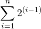
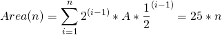

# Pythagorean Tree Fractal 2

We are given the same pattern of rectangles, and told the area of the square in stage 1 is 70368744177664. The question is, what is the area of the Stage 25 tree.

Well, for stage n, there are `2^n - 1` squares.

Alternatively, you could say that at each stage, there is a summation of rectangles.

For stage n, there are:



rectangles.

The first rectangle has an area of `A` (where `A` is 70368744177664).

What is the area of the second two rectangles?

They both are anchored at the corner of the first triangle and touch at exactly half way. We can also tell it's a square. This constrains that inner angle to be 45 degrees. Therefore, this second set of rectangles squares has sides that are 1/sqrt(2) the size of the original square. If that square had an area of A, we would say that these new squares have an area of A/2. In fact, for each level, the area of each new square is 1/2 the area of the previous level's new square.

So, for level 1, there is 1 square of area A.

For level 2, there is 1 square of area A, and 2 squares of area A/2.

For level 3, there is 1 square of area A, 2 squares of area A/2, and 4 squares of area A/4.



<details><summary>Spoiler (Output Includes Flag)</summary>
<p>

70368744177664*25 = 1759218604441600

```
flag{1759218604441600}
```

</p>
</details>

---
Andrew Steadman