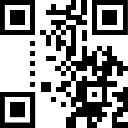

# N-95

We are given a partially obscured QR code. I've opened the image up in an image editor, filled in the partially obscured dots, and added the missing "fixed" patterns (the large squares in the corners, and the two ribbons of alternating dots).



Unfortunately, this is not enough for most QR decoders. Let's dig deeper.

## The sandbox

I created a quick webpage to overlay a generated QR code overtop of our known QR code : https://codepen.io/asteadman/pen/wvMBmLK .

The overlay is 25% transparent, and is colored blue. In places where the overlay matches, we get a dark blue or solid white colour. In places where the known QR has a black square, but not our generated QR code, we get a light grey colour. Likewise, when the generated QR has a coloured square but not the known QR code, it appears as light blue.

We know the beginning of the message is "flag{", and the last character is "}". We now need to figure out roughly how long the flag is. First, we add characters between "{" and "}" until the pixel density looks right. This doesn't yet tell us the exact length, but gives us a minimum length.

> Note: QR codes can have varying amounts of protection. I've told the encoder to use the lowest protection level, since that will allow us to pack more data into the message. The protection bits (a reed-solomon code) mostly appear on the left of the image between the two squares and spilling slightly into the middle. Since those parts of the image are missing, it's safe to assume the image was encoded in such a way that those were not important.

QR codes can have 1 of 7 different masks applied to them, and the mask chosen will drastically change the "appearance" of the image. Generally, the mask depends on the message, and changing the message even slightly will cause it to choose a different (more optimal mask). Through trial and error I determined that the 4th mask had the best match to the source image and likely was the mask used, so I hardcoded the encoder to **only** use this mask.

Now, we need to figure out the length of the flag. If we look at the very bottom right-hand corner of the QR code, we can figure out how long the flag is by filling in the unknown message values until this bottom right-hand corner looks right (it contains a length field).

Now that we know the length, the trick is to step through the message 1 bit at a time and see if we can figure out which bit is correct. I've added 3 buttons to the page, one for "prev", one for "next", and one for "toggle". You hit toggle a couple times to see if the match is better or worse, then you hit "next" to go to the next bit.

In general, the exact location of any given bit hops around quite a bit. The eye is pretty good at picking up slight changes, and stepping through the message shouldn't take too long. It's important to ignore the squares on the left between the top and bottom squares, since these are the reed-solomon blocks and they will drastically change along with the message.

## Answer

After a bit of clicking, you should be able to determine the flag

<details><summary>Spoiler (Output Includes Flag)</summary>
<p>


```
flag{60_dozen_quartz_jars}
```

</p>
</details>

---

Andrew Steadman
